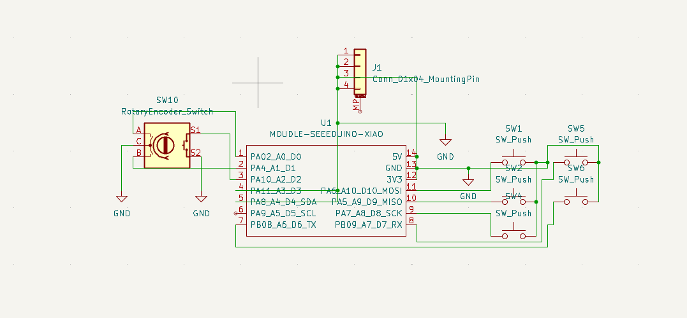
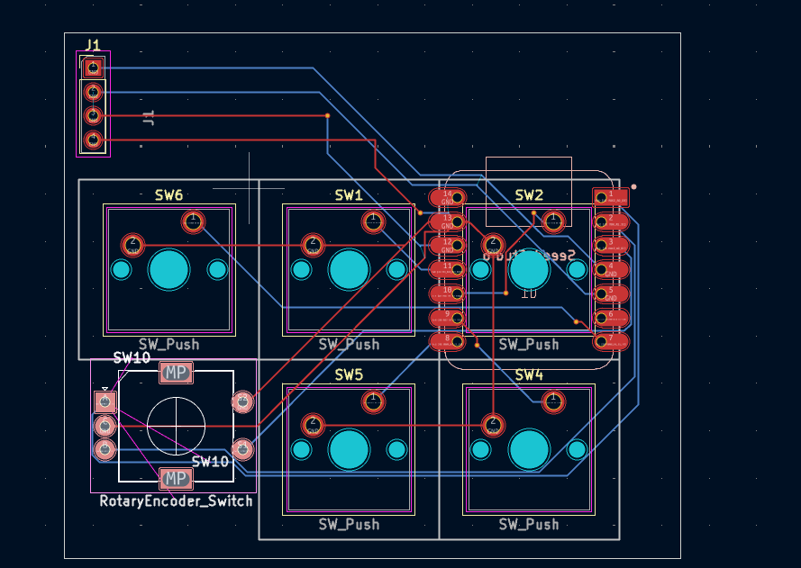
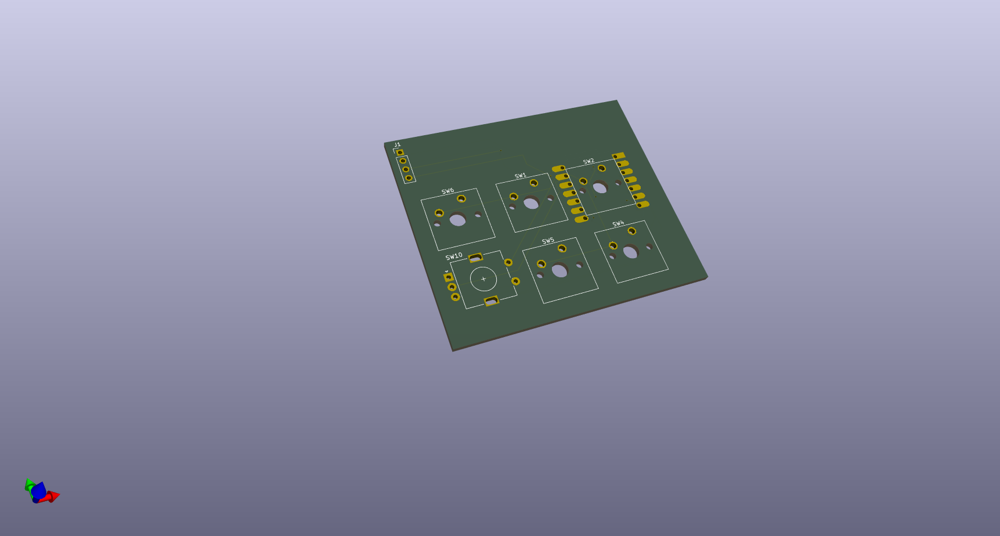

This Macropad has 6 keys for media control and microphone with a rotary encoder for scrolling with qmk firmware. It also has an OLED display.

## Features

  -scrolling up/down
  -muting/unmuting the microphone
  -controlling media(e.g. skip track, pause, previous track)

## BOM
  
| Part                  | Quantity | Price (each) | Total   | Notes                        

 Seeed XIAO RP2040      1       | $6.50        | $6.50   Main MCU                      
 Switches with keycaps  5       | $0.50        | $2.50   TS-style, direct pin          
 Rotary encoder w/button  1     | $1.20        | $1.20   3-pin encoder                 
 OLED display 0.91"     1       | $3.00        | $3.00   4-pin standard display
 3D-printed case        1 set   | $2.00        | $2.00   PLA, ~50 g 
 
Total : ~15.20 USD

## Layout

| SW1 (Undo) | SW2 (Prev) | SW6 (Next) |

| S1 (Mute)  | SW4 (Enter)| SW5 (Play) |

## PCB
This is the schematic for the PCB, made in KiCad

And this is the footprint

## Case

The case will be held tight by 4 M3x16 mm screws and it can be fuly 3D printed

